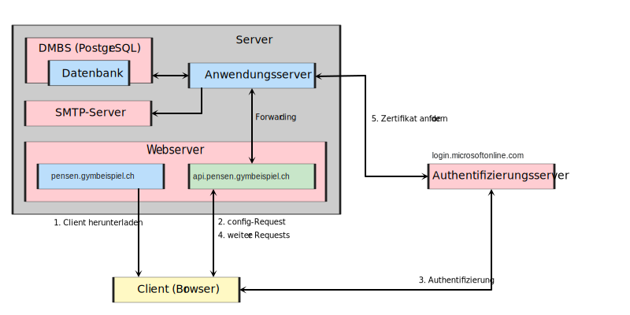
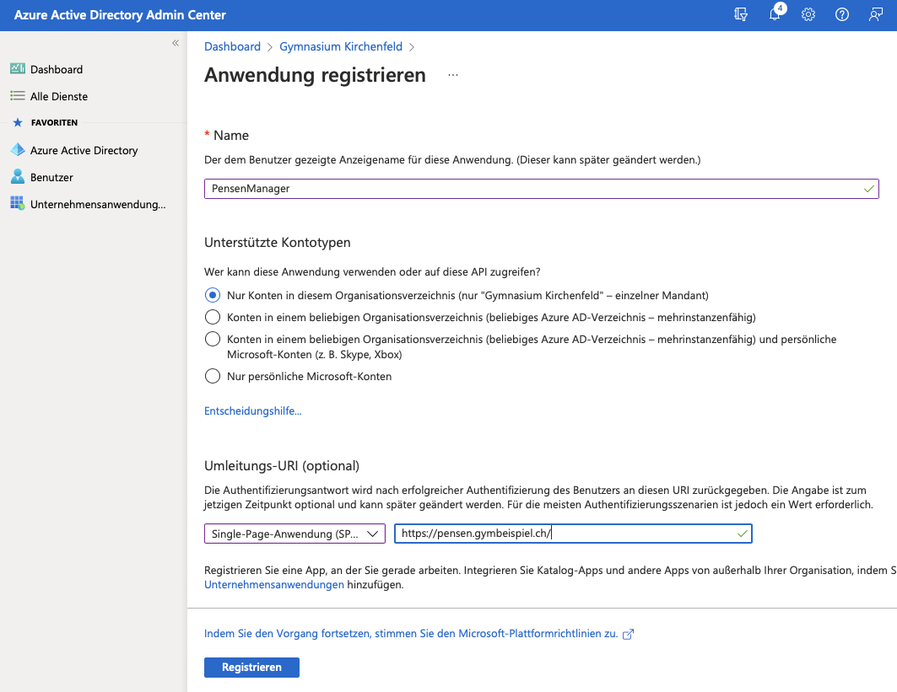
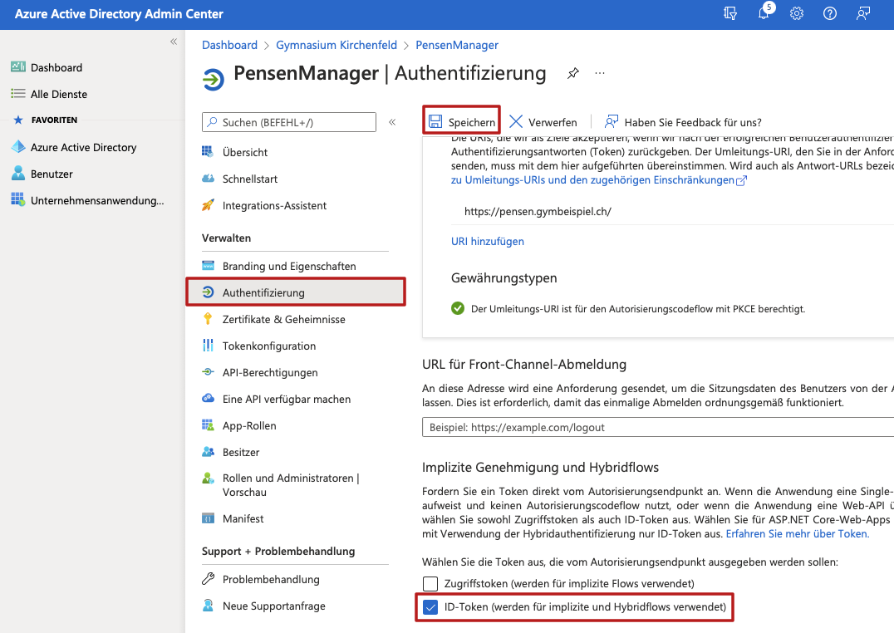
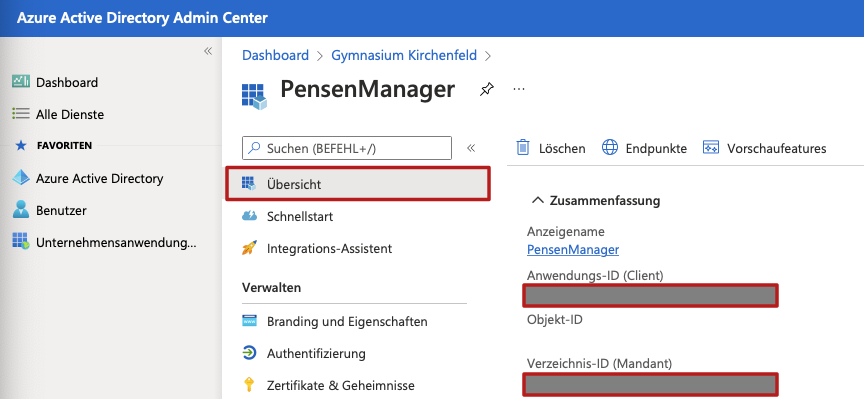

## Voraussetzungen

Für die Installation des Pensenmanagers wird ein Linux-Server benötigt. Dies kann ein physischer oder ein virtueller Server sein. Wenn gewünscht kann das Datenbank-Managementsystem (DBMS) auf einem separaten Server betrieben werden. Es wird folgende Software benötigt:

- Java Standard Edition 17 oder neuer (z.B. OpenJDK)
- Apache Webserver (oder ein anderer Webserver vergleichbaren Features)
- PostgreSQL 11 oder neuer
- Ein Azure Active Directory für die Authentifizierung der Benutzer
- Ein SMTP-Server, welcher E-Mails ohne Authentifizierung entgegennimmt.

## Übersicht



Der Pensenmanager besteht aus drei Komponenten: einem Web-Client, einem Anwendungsserver und einer Datenbank. Damit die Anwendung betrieben werden kann, wird eine gewisse Infrastruktur benötigt:

- ein Datenbank-Managementsystem (PostgreSQL)
- eine Microsoft Azure-Infrastruktur für die Authentifizierung
- einen Webserver (Apache oder Nginx)
- einen SMTP-Server

## Datenbank-Managementsystem

Auf dem DBMS (PostgreSQL) muss folgendes manuell eingerichtet werden:

- Eine Datenbank mit dem Namen `pensen`.
- Eine Gruppenrolle (Group Role) mit dem Namen `pensenmanager`.
- Einen Datenbank-Benutzer mit dem Namen `db_pensen`, welcher Mitglied der Gruppenrolle `pensenmanager` ist.

Diese Bezeichnungen können frei gewählt und in der [Konfigurationsdatei](craftdocs://open?blockId=C69CD3E2-5F0E-4748-9882-AFD50B74FD92&spaceId=68d14efe-ea4e-24bf-7abd-861547154287) angepasst werden. Für den Benutzer sollte ein sicheres Passwort gewählt werden, welches ebenfalls in der [Konfigurationsdatei](craftdocs://open?blockId=C69CD3E2-5F0E-4748-9882-AFD50B74FD92&spaceId=68d14efe-ea4e-24bf-7abd-861547154287) eingetragen werden muss.

## Anwendungsserver

### Starten des Anwendungsservers

Der Anwendungsserver wird mit folgendem Befehl gestartet:

```other
java -cp [Jar] -Dconfig.file=[Conf] ch.kinet.pensen.server.Server
```

Dabei wird `[Jar]` durch den vollständigen Pfad zur Jar-Datei des Anwendungsservers ersetzt. `[Conf]` wird durch den vollständigen Pfad zur [Konfigurationsdatei](craftdocs://open?blockId=C69CD3E2-5F0E-4748-9882-AFD50B74FD92&spaceId=68d14efe-ea4e-24bf-7abd-861547154287) ersetzt.

### Systemd-Service einrichten

Der Anwendungsserver wird am besten als Service eingerichtet. Hier ist eine Bespiel-Service-Datei für systemd:

```other
[Unit]
Description=Pensen Server
After=syslog.target network.target remote-fs.target nss-lookup.target

[Service]
Type=simple
Environment=LC_ALL=de_CH.UTF-8
WorkingDirectory=/opt/pensen
ExecStart=java -cp /opt/pensen/pensen-server.jar -Dconfig.file=/etc/pensen/application.cfg ch.kinet.pensen.server.Server
Restart=on-failure
LimitNOFILE=10000

[Install]
WantedBy=multi-user.target
```

## Webserver

Auf dem Webserver müssen zwei Virtual Hosts eingerichtet werden. Der eine Virtual Host stellt den Client zu Verfügung, der andere leitet API-Anfragen an den Anwendungsserver weiter.

Als Webserver kann Apache oder Nginx eingesetzt werden.

### Konfiguration `api.pensen.gymbeispiel.ch`

Der Webserver nimmt die SSL-Verbindung des Client entgegen und leitet die unverschlüsselten HTTP-Anfragen lokal an den Java-Anwendungsserver weiter.

Der HTTP-Port des Anwendungsservers ist per Default 9001, kann aber in der [Konfigurationsdatei](craftdocs://open?blockId=C69CD3E2-5F0E-4748-9882-AFD50B74FD92&spaceId=68d14efe-ea4e-24bf-7abd-861547154287) angepasst werden.

#### Headers

Der Anwendungsserver liefert bei Antworten die folgenden Headers mit. Diese müssen vom Webserver an den Client weitergereicht werden.

| **Header**                     | **Wert**                                                                          |
| ------------------------------ | --------------------------------------------------------------------------------- |
| `Access-Control-Allow-Headers` | `Authorization`                                                                   |
| `Access-Control-Allow-Origin`  | `*`                                                                               |
| `Access-Control-Allow-Methods` | `DELETE,GET,PATCH,POST,PUT`                                                       |
| `Access-Control-Max-Age`       | `0`                                                                               |
| `Content-Security-Policy`      | `base-uri 'none'; default-src 'none'; form-action 'none'; frame-ancestors 'none'` |
| `Strict-Transport-Security`    | `max-age=15552000; includeSubDomains; preload`                                    |

Als Webserver kann Apache oder vermutlich auch Nginx eingesetzt werden.

#### Konfigurationsbeispiel Apache

Hier ist eine Beispiel-Konfigurationsdatei für Apache:

```xml
<VirtualHost 255.255.255.255:443>
        ServerName api.pensen.gymbeispiel.ch

        DocumentRoot /var/www/api.pensen.gymbeispiel.ch
        DirectoryIndex index.html

        <Directory /var/www/api.pensen.gymbeispiel.ch>
                Require all granted
        </Directory>

        SSLEngine On
        SSLCertificateFile      /var/lib/dehydrated/certs/api.pensen.gymbeispiel.ch/cert.pem
        SSLCertificateKeyFile   /var/lib/dehydrated/certs/api.pensen.gymbeispiel.ch/privkey.pem
        SSLCertificateChainFile /var/lib/dehydrated/certs/api.pensen.gymbeispiel.ch/chain.pem
        SSLCACertificateFile    /var/lib/dehydrated/certs/api.pensen.gymbeispiel.ch/fullchain.pem
        SSLOpenSSLConfCmd DHParameters /etc/ssl/private/dhparams_4096.pem

        ProxyPreserveHost On
        ProxyPass / http://127.0.0.1:9001/ retry=0
        ProxyPassReverse / http://127.0.0.1:9001/

        LogLevel warn

        CustomLog ${APACHE_LOG_DIR}/api.pensen.gymbeispiel.ch/access.log combined
        ErrorLog ${APACHE_LOG_DIR}/api.pensen.gymbeispiel.ch/error.log
</VirtualHost>
```

#### Konfigurationsbeispiel Nginx

```python
server {
	listen 443 http2;
	listen [::] http2;

	server_name api.pensen.gymbeispiel.ch;

    root /var/www/api.pensen.gymbeispiel.ch;
    index index.html;

	location / {
   		proxy_pass http://127.0.0.1:9001;
	}
}
```

### Konfiguration `pensen.gymbeispiel.ch`

#### Content Security Policy

Besonders beachtet werden muss bei den Content Security Policy-Einstellungen folgendes:

- Verbindungen zum Anwendungsserver (z.B. `https://api.pensen.gymbeispiel.ch`) müssen erlaubt werden.
- Verbindungen zum Microsoft-Anmeldungsserver (`https://login.microsoftonline.com`) müssen erlaubt werden.
- Schriften und CSS-Dateien müssen von `https://cdn.jsdelivr.net` und `https://fonts.gstatic.com` geladen werden können.

Es werden die folgenden Einstellungen benötigt:

| **CSP-Einstellung** | **Wert(e)**                                                                                    |
| ------------------- | ---------------------------------------------------------------------------------------------- |
| `base-uri`          | `'none'`                                                                                       |
| `default-src`       | `'none'`                                                                                       |
| `connect-src`       | `'self'<br/>data:<br/>https://api.pensen.gymbeispiel.ch<br/>https://login.microsoftonline.com` |
| `font-src`          | `'self'<br/>data:<br/>https://fonts.gstatic.com<br/>https://cdn.jsdelivr.net`                  |
| `form-action`       | `'none'`                                                                                       |
| `frame-ancestors`   | `'none'`                                                                                       |
| `img-src`           | `data:<br/>'self'`                                                                             |
| `manifest-src`      | `'self'`                                                                                       |
| `object-src`        | `'none'`                                                                                       |
| `script-src`        | `'self'`                                                                                       |
| `style-src`         | `'self'<br/>'unsafe-inline'<br/>https://cdn.jsdelivr.net<br/>https://fonts.googleapis.com`     |

#### Konfigurationsbeispiel Apache

```xml
<VirtualHost 255.255.255.255:443>
        ServerName pensen.gymbeispiel.ch

        DocumentRoot /var/www/pensen.gymbeispiel.ch
        DirectoryIndex index.html

        <Directory /var/www/pensen.gymbeispiel.ch>
                Require all granted

                RewriteEngine On
                RewriteBase /
                RewriteRule ^index\.html$ - [L]
                RewriteCond %{REQUEST_FILENAME} !-f
                RewriteCond %{REQUEST_FILENAME} !-d
                RewriteRule . /index.html [L]
        </Directory>

        SSLEngine On
        SSLCertificateFile      /var/lib/dehydrated/certs/pensen.gymbeispiel.ch/cert.pem
        SSLCertificateKeyFile   /var/lib/dehydrated/certs/pensen.gymbeispiel.ch/privkey.pem
        SSLCertificateChainFile /var/lib/dehydrated/certs/pensen.gymbeispiel.ch/chain.pem
        SSLCACertificateFile    /var/lib/dehydrated/certs/pensen.gymbeispiel.ch/fullchain.pem
        SSLOpenSSLConfCmd DHParameters /etc/ssl/private/dhparams_4096.pem

        Header always set Content-Security-Policy "base-uri 'none'; default-src 'none'; connect-src 'self' data: https://api.pensen.gymbeispiel.ch https://login.microsoftonline.com; font-src 'self' data: https://fonts.gstatic.com https://cdn.jsdelivr.net; form-action 'none'; frame-ancestors 'none'; img-src data: 'self'; manifest-src 'self'; script-src 'self'; style-src 'self' 'unsafe-inline' https://cdn.jsdelivr.net https://fonts.googleapis.com"
        Header always set Strict-Transport-Security "max-age=15552000; includeSubDomains; preload"

        LogLevel warn

        CustomLog ${APACHE_LOG_DIR}/pensen.gymbeispiel.ch/access.log combined
        ErrorLog ${APACHE_LOG_DIR}/pensen.gymbeispiel.ch/error.log
</VirtualHost>
```

## Azure AD

Der Pensenmanager authentifiziert Benutzer am Microsoft Azure Active Directory mittels Web Token. Dazu muss die Anwendung im Azure AD wie folgt registriert werden:

1. Anmeldung am Azure AD

[Microsoft Entra admin center](https://aad.portal.azure.com/)

2. App Registrieren

- In Azure Active Directory den Punkt App-Registrierungen auswählen.
- Auf Neue Registrierung klicken.
- Den Namen der App eingeben (z.B. `PensenManager`).



- Unter Umleitungs-URI die Option Single-Page-Anwendung auswählen und die URL des Clients angeben (z.B. `https://pensen.gymbeispiel.ch/` ).
- Auf Registrieren klicken.

3. ID-Token aktivieren

Nun muss unbedingt die Authentifizierung mittels ID-Token aktiviert werden:

- Eintrag Authentifizierung auswählen.
- Bei ID-Token Häkchen setzen.
- Oben auf Speichern klicken.



4. IDs in Konfigurationsdatei übertragen

Nun müssen die Anwendungs-ID sowie die Mandant-ID in die [Konfigurationsdatei](konfiguration) übertragen werden.



## SMTP-Server 🚧
